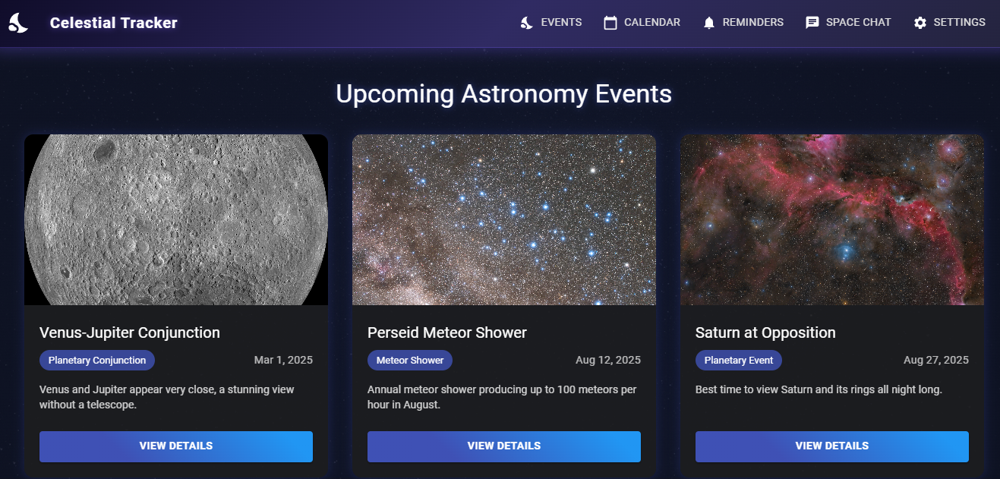
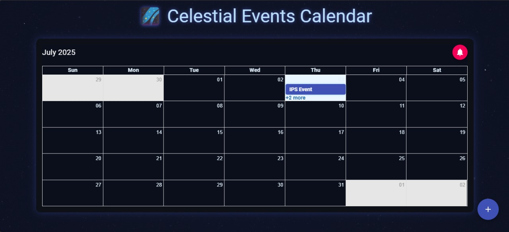
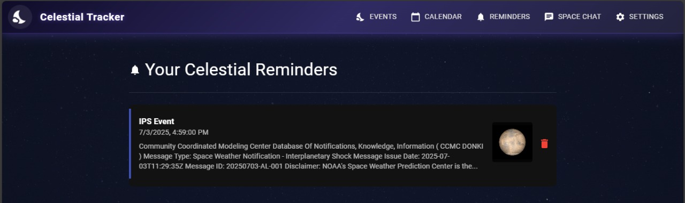
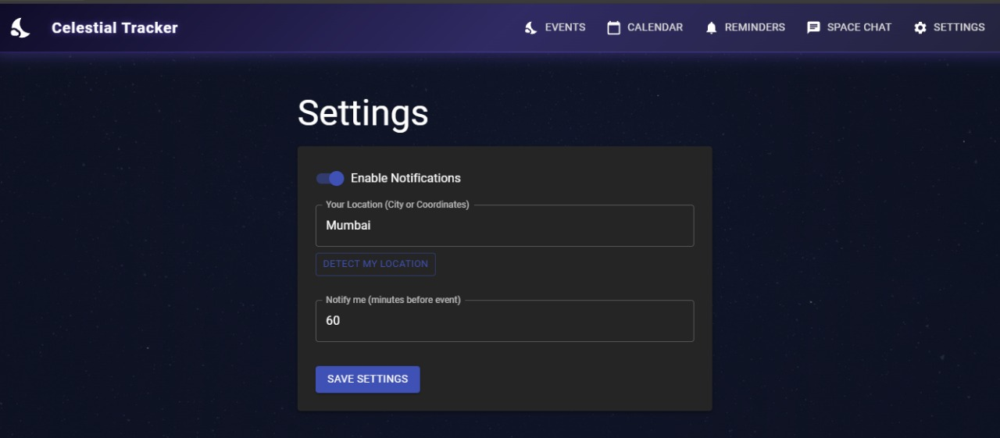
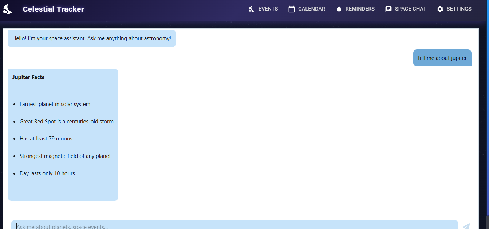
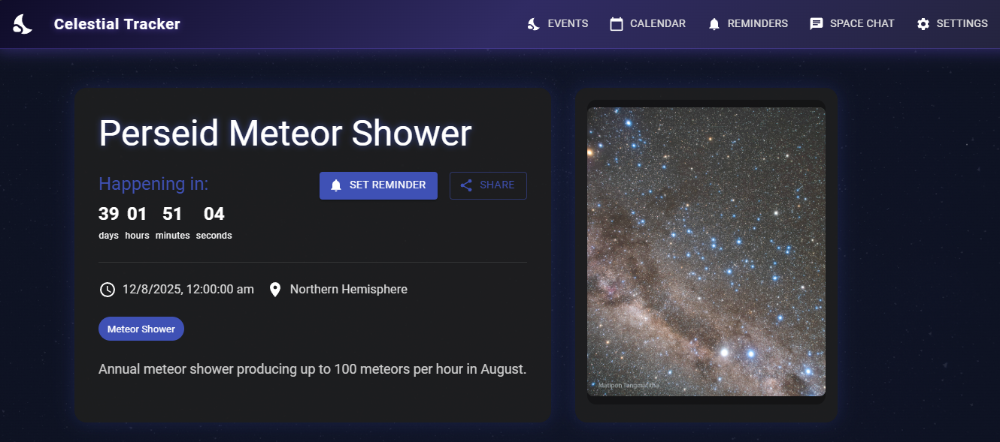

# 🌌 Celestial Tracker

Celestial Tracker is an interactive web application designed to bring the cosmos closer to amateur astronomers and space lovers. It combines real-time data, beautiful visualizations, and user-friendly tools to make skywatching simple and inspiring.

---

## 🌠 Inspiration

The night sky has fascinated humanity for millennia. We created **Celestial Tracker** to bridge the gap between professional astronomy data and amateur stargazers. Our inspiration came from:

- 🌌 The beauty of NASA's Astronomy Picture of the Day  
- 📡 The challenge of making complex space weather data accessible  
- 🌍 A desire to help people discover celestial events in their area  
- 🚀 The growing interest in space exploration and astronomy  

---

## ✨ What It Does

- 🪐 **Displays Upcoming Astronomical Events**  
- 🌞 **Shows Real-time Space Weather Alerts**  
- 🔭 **Provides Observation Recommendations**  
- 📱 **Mobile-Friendly Dashboard**  
- 🌌 **Cosmic Event Visualization**  

---

## 🧠 Features Preview

### 🌠 Astronomical Events View  
Displays key upcoming celestial events like eclipses and meteor showers.  


### 🗓 Calendar View  
Interactive event calendar with celestial highlights.  


### 🔔 Reminders and Alerts  
Get notified about major cosmic happenings.  


### ⚙️ Settings Panel  
Configure your location, time zone, and display preferences.  


### 🤖 Space Chatbot  
Ask astronomy-related questions and receive intelligent responses.  


### 🔍 Detailed Event View  
Learn more about each event, with visuals and observation tips.  


---

## 🛠 How We Built It

### 🚀 Frontend Tech Stack
```js
// Tech Stack
const stack = {
  core: "React + Vite",
  ui: "Material-UI with custom space theme",
  state: "Context API + React Query",
  routing: "React Router 6", 
}


Developed By : 
-Jyoti Fabiyani
-Urvashi Changlani
-Vaishnavi Chaudhari